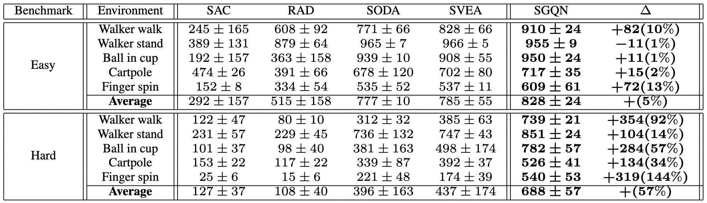
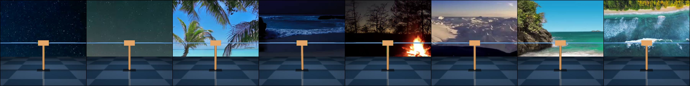

# Overview



## Setup
We assume that you have access to a GPU with CUDA >=9.2 support. All dependencies can then be installed with the following commands:

```
conda env create -f setup/conda.yml
conda activate dmcgb
sh setup/install_envs.sh
```

If you don't have the right mujoco version installed: 
```
sh setup/install_mujoco_deps.sh
sh setup/prepare_dm_control_xp.sh
```


## Datasets

```
wget http://data.csail.mit.edu/places/places365/places365standard_easyformat.tar
```
After downloading and extracting the data, add your dataset directory to the datasets list in `setup/config.cfg`.

# Run `SGQN` training:
```bash
python src/train.py --algorithm sgsac --sgqn_quantile [QUANTILE] --seed [SEED] --eval_mode video_easy --domain_name [DOMAIN] --task_name [TASK];
```
You can also run `SVEA`, `SODA`, `RAD`, `SAC`.


# DMControl Generalization Benchmark

Benchmark for generalization in continuous control from pixels, based on [DMControl](https://github.com/deepmind/dm_control).

## Test environments

The DMControl Generalization Benchmark provides two distinct benchmarks for visual generalization, *random colors* and *video backgrounds*:


Both benchmarks are offered in *easy* and *hard* variants. Samples are shown below.

**video_easy**<br/>


**video_hard**<br/>


